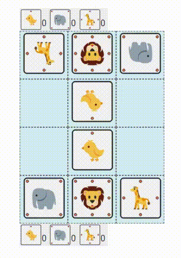

streamlit-doubutsushogi
=============
[](https://badge.fury.io/py/streamlit-doubutsushogi)
[](https://kota7-streamlit-doubutsushogi-appstreamlit-app-weir3f.streamlit.app/)

A streamlit custom component for interactive board of [doubutsushogi (animal chess)](https://en.wikipedia.org/wiki/D%C5%8Dbutsu_sh%C5%8Dgi) game.


## Install

```shell
# from pypi
pip3 install streamlit-doubutsushogi

# or from github
# see also the streamlit component API manual (https://docs.streamlit.io/library/components/components-api)
git clone https://github.com/kota7/streamlit-doubutsushogi.git
cd streamlit-doubutsushogi/streamlit_doubutsushogi/frontend
npm run build
pip3 install -U ../../
```

## Usage

See the minimal example at [example.py](./example.py):

```python
import streamlit as st
from streamlit_doubutsushogi import st_doubutsushogi

c1, c2 = st.columns([6, 6])
with c1:
    state, status, action = st_doubutsushogi()

if status != 0:
    c2.write(f"Game over! Won by the player {status}")
```

Run the script by:

```shell
streamlit run example.py
```




## Doubutsu Shogi Master App

An interactive app is deployed on the [Streamlit Cloud](https://kota7-doubutsushogi-py-streamlitapp-fyc9on.streamlit.app/).
To run the app on the computer locally, run the following:

```shell
streamlit run app/streamlit_app.py
```


## Tips

### How to upload this app to PyPI

```shell
# 1. build javascript sources
cd streamlit_doubutsushogi/frontend && npm run build && cd ../../
# 2. make python package wheel
rm -r build dist *.egg-info   # only for the second time or later
python3 setup.py sdist bdist_wheel
# 3. upload to PyPI
twine upload --repository pypi dist/*
```

1. Build the javascript application
1. Make Python package wheel
1. Upload to PyPI